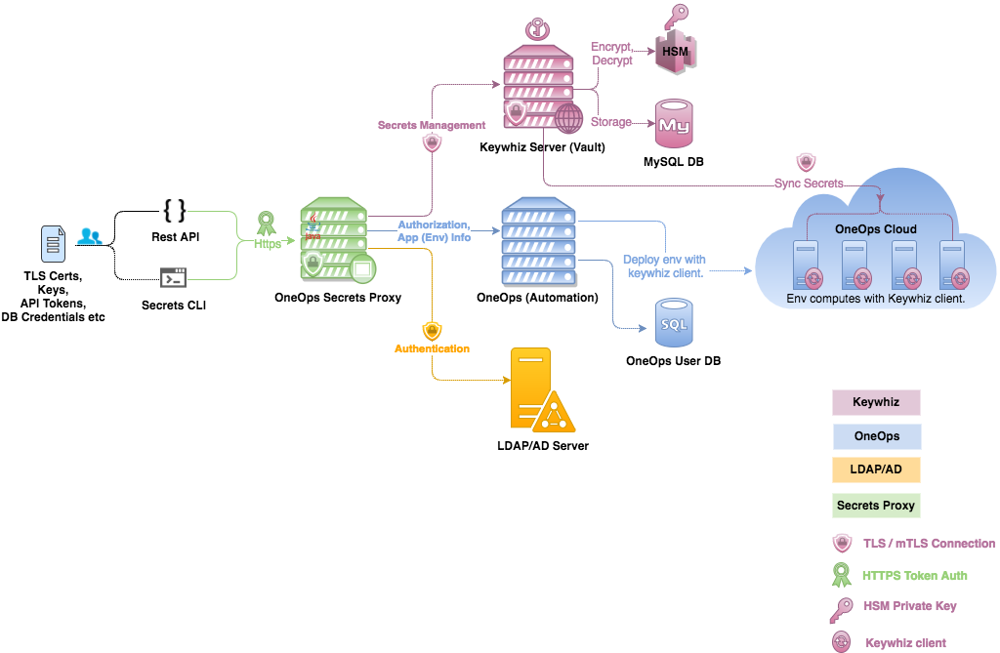

<div align="center">

# :key: OneOps Secrets Proxy 

[![Maven Central][maven-svg]][maven-url] [![api-doc][apidoc-svg]][apidoc-url] [![java-doc][javadoc-svg]][javadoc-url] [![changelog][cl-svg]][cl-url] 

 A secure proxy service for managing [OneOps][oneops-url] secrets.
 
</div>



## How to run
 > Set all the [secrets-proxy env](contrib/init/systemd/keywhiz-proxy-env) vars.
 
 ```bash
 $ ./mvnw clean package
 $ java -jar target/secrets-proxy-<version>.jar
 ```
 
### Docker 

  * Build the `secrets-proxy` image
    
    ```
     $ git clone https://github.com/oneops/secrets-proxy.git
     $ cd secrets-proxy
     $ docker build -t secrets-proxy:1.2.0 .
    ```  
    
  * Run `secrets-proxy` image
  
    > Before running make sure you have the proper [secrets-proxy env](contrib/init/systemd/keywhiz-proxy-env) file and 
    all the [keystores](#oneops-secrets-proxy-keystores) under `/path/to/secrets`
    
    ```
     $ docker run -it --rm --name secrets-proxy -p 8443:8443  --env-file=/path/to/secrets/keywhiz-proxy-env  -v /path/to/secrets:/secrets -d secrets-proxy:1.2.0
     $ open https://localhost:8443/apidocs
    ``` 
    
  * Debugging and Logs
  
    ```
    $ docker exec -it secrets-proxy sh
    # cd log/
    # ls -ltrh
    total 48
    drwxr-xr-x    2 root     root        4.0K May  4 23:05 audit
    drwxr-xr-x    2 root     root        4.0K May  4 23:05 access
    -rw-r--r--    1 root     root       39.4K May  4 23:05 keywhiz-proxy.log
    ```       

## OneOps Secrets-Proxy Keystores

  The following Trust-stores/Keystores are used in Secrets-proxy application.
  
  - [keywhiz_proxy_keystore.p12](src/main/resources/keystores/keywhiz_proxy_keystore.p12) 
  
      The default TLS server certificate for Keywhiz-Proxy application. This is a self-signed TLS cert with 
      the following details.
          
      * Common Name    : `keywhiz-proxy.dev.oneops.com`
      * Key Password   : `kwproxy-password`
      * Store Password : `kwproxy-password` 
         
     ```
      For production deployment, contact your infosec team to get new TLS server certificate.
     ```
                 
  - [keywhiz_keystore.p12](src/main/resources/keystores/keywhiz_keystore.p12) 
  
      The keywhiz automation **mTLS client certificate**. Used for all the keywhiz server automation API calls.
      Make sure the client has been registered and `automationAllowed=true` on the keywhiz server. The client cert
      has to be trusted by the same RootCA used on Keywhiz server.
      
     ```
     For production deployment, contact your infosec/keywhiz server team to get new TLS client certificate.
     ```

  - [keywhiz_truststore.p12](src/main/resources/keystores/keywhiz_truststore.p12) 
  
      The keywhiz server trust-store, containing the trusted CA (Certificate Authorities) certs or cert chains. 
      Used for all the keywhiz server admin/automation API calls.
 
     ```
      For production deployment, use openssl to create trustore of your keywhiz server.
     ```
     or you can use tool like [InstallCerts](https://github.com/sureshg/InstallCerts) to auto-generate trust-store
     from the TLS endpoint.
     
                   
  - [ldap_truststore.p12](src/main/resources/keystores/ldap_truststore.p12) 
  
      Your LDAP/AD server trust-store, containing the trusted CA (Certificate Authorities) certs or cert chains. 
      Used for AD/LDAP user authentication APIs.
    
      ```
       For production deployment, use openssl to create trustore of your AD/LDAP server.
      ```
      or you can use tool like [InstallCerts](https://github.com/sureshg/InstallCerts) to auto-generate trust-store
      from the TLS endpoint.  

### Keysync

   [Keysync](https://github.com/square/keysync) is the keywhiz client used on computes to sync secrets. Inorder to build keysync,
   
   ```bash
   # Make sure to install go (https://golang.org/dl/)
   # export GOOS=linux
   $ mkdir ~/tmp
   $ export GOPATH=$HOME/tmp
   $ go get -u github.com/square/keysync
   $ cd $GOPATH/src/github.com/square/keysync
   $ go build -o keysync ./cmd/keysync/
   $ ./keysync --help
   ```               
### Generate JOOQ source.

```bash
 $ ./mvnw clean package -P generate
```
   
#### Misc
 
  * Secrets Tools - https://github.com/oneops/secrets-proxy/releases/tag/tools
  * JWT Token Verification - https://jwt.io/
  * [REST API References](https://news.ycombinator.com/item?id=11971491)   

#### TODO
 
 * Springboot admin integration.
 * Prometheus metrics integration.
 * X509 Authentication.
 * Feature toggles implementation.
 * Http2/Grpc (May be with JDK 9)
 * JTI claim to maintain list of blacklisted or revoked tokens.
 


#### Why we chose Spring Boot

 * https://twitter.com/springcentral/status/878264199729860608
 * https://twitter.com/fintanr/status/877988573399531520
 * https://www.jetbrains.com/research/devecosystem-2017/java/ (Check the Web framework section)
 
 License
 -------
 
     Licensed under the Apache License, Version 2.0 (the "License");
     you may not use this file except in compliance with the License.
     You may obtain a copy of the License at
 
        http://www.apache.org/licenses/LICENSE-2.0
 
     Unless required by applicable law or agreed to in writing, software
     distributed under the License is distributed on an "AS IS" BASIS,
     WITHOUT WARRANTIES OR CONDITIONS OF ANY KIND, either express or implied.
     See the License for the specific language governing permissions and
     limitations under the License.
     
 -----------------
 <sup><b>**</b></sup>Require [Java 8 or later][java-download]
 
 <!-- Badges -->
 [maven-url]: http://search.maven.org/#search%7Cgav%7C1%7Cg%3A%22com.oneops%22%20AND%20a%3A%22secrets-proxy%22
 [maven-svg]: https://img.shields.io/maven-central/v/com.oneops/secrets-proxy.svg?label=Maven%20Central&style=flat-square
 
 [apidoc-url]: https://oneops.github.com/secrets-proxy/apidocs
 [apidoc-svg]: https://img.shields.io/badge/api--doc-latest-green.svg?style=flat-square
 
 [javadoc-url]: https://oneops.github.com/secrets-proxy/javadocs
 [javadoc-svg]: https://img.shields.io/badge/java--doc-latest-ff69b4.svg?style=flat-square
 
 [cl-url]: https://github.com/oneops/secrets-proxy/blob/master/CHANGELOG.md
 [cl-svg]: https://img.shields.io/badge/change--log-latest-blue.svg?style=flat-square
 
 [oneops-url]: http://oneops.com/developer/index.html
 [java-download]: http://www.oracle.com/technetwork/java/javase/downloads/index.html
 